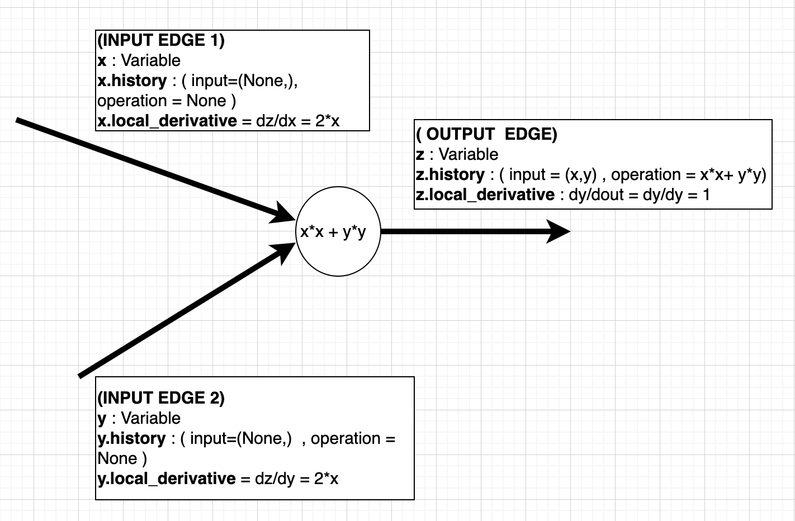

## Overall Deisgn
- class `Variable` :
    - Wrapper over general Numbers. We should be able to manipulate them just like regular python numbers. We do some operator-overloading to do so.
    - Variable has the following Attributes:

        `history` :  
        Stores what `Function` and `Inputs` (these inputs are again instances of `Variable`) created our `Variable`.
        So, that's it. For each of these `inputs`, will have information of what `Function` and `Variables` created those inputs, and we can parse the whole tree backwards. 
    
        `derivative` : The Derivative w.r.t this variable

- class `Function` : 
    - Wrapper over basic operations
    - computes over the `Variable`, and returns a new-Variable

## AutoDiff info

- For each Variable (Node), I know that other Variables, and function created it. So, I know local derivative of output (aka Variable at hand) wrt. these inputs

<figure>

<figcaption> <b> Diagram on How Pytorch/Minitorch represents Variables and Functions</b></figcaption>
</figure>

- Each Arrow is a Variable and Those Vertices   represent operations ! 

  Terms Node/Variable/Arrow is being used Interchangably (So, Don't think of those Vertices as Nodes. In our case, node is the arrow. Yeah it's confusing.)

- What's the `Derivative for a Variable` in minitorch ? => 
Imagine Deriv. of Output of a Operation W.r.t. that Variable  => `variable.local_derivative`